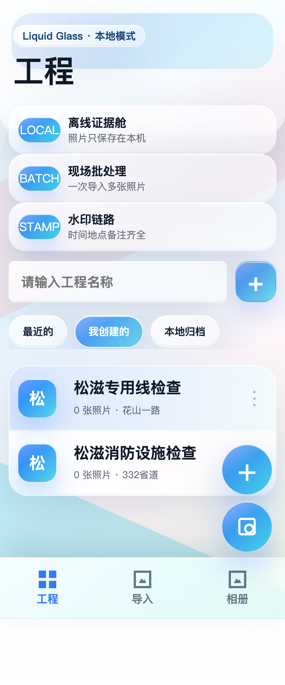

# 无广水印

一个本地版水印相机：不登录、不上传云端、不看广告，拍照或批量导入照片后，把工程、地点、经纬度、天气和时间压到图片水印里，并直接保存到手机相册。

> 当前版本是 debug APK，适合自己和朋友测试安装。正式上架还需要 release 签名和商店材料。

## 下载

- GitHub Release：<https://github.com/xiaochen8360/no-ad-watermark-camera/releases/tag/v0.1.0-debug>
- APK：[`release/no-ad-watermark-camera-debug.apk`](release/no-ad-watermark-camera-debug.apk)
- 微信传输压缩包：[`release/no-ad-watermark-camera-debug.zip`](release/no-ad-watermark-camera-debug.zip)
- APK SHA256：`89d57bacb66dad5890c22ea2c5c8b64cb8dc476339626a025fee663642bd65fa`

如果从 GitHub 下载，建议点 Releases 里的 APK；如果微信直接传 APK 被拦，可以传 zip，收到后解压安装。

## 我的自白

不喜欢形式主义，特别是现在的特别严重。各种照片打卡，然后各种照片大概又要加水印加时间。麻烦。

我们现在用的是哪一款软件？碰到水印相机，打开这个广告又多，每次拍照片太麻烦。所以我就开发了这个本地水印，支持一键水印添加、批量导入，免去广告。

这就是我的直白，我现在把它免费分享出来，希望少一点拍照打卡上浪费时间。

## 我到底开发了一个什么东西？

这是一个给现场拍照、工程留痕、日常打卡减负用的小工具。它不是为了把拍照打卡变得更复杂，而是为了把重复劳动压缩掉。

- **本地水印相机**：打开相机就能看到实时水印，拍完直接生成带水印照片。
- **工程管理**：按工程归档照片，工程名会自动进入水印。
- **默认地点**：可以手动维护常用地点，不用每次重复输入。
- **批量导入**：一次选多张图，按设定时间段随机写入拍摄时间，精确到秒。
- **手机相册保存**：照片写入手机系统相册，方便在相册、微信、文件管理里找到。
- **无广告**：没有启动广告、弹窗广告、会员广告。
- **拼图汇报**：从相册里选照片，生成工作汇报图并保存到本地相册。

## 截图

| 工程页 | 批量导入 |
|---|---|
|  


## 安装方式

1. 下载 `no-ad-watermark-camera-debug.apk`。
2. 安卓手机提示时，允许“安装未知来源应用”。
3. 安装后打开“无广水印”。
4. 首次拍照或保存时，根据提示授权相机、定位和相册/存储权限。

## 权限说明

- **相机权限**：用于实时取景和拍照。
- **定位权限**：用于读取经纬度；中文地点目前主要用手动默认地点。
- **相册/存储权限**：用于把带水印照片保存到手机相册。
- **网络权限**：当前版本不依赖云端上传，保留给后续地址反查或兼容 WebView。

## 开发和打包

项目是一个轻量 Android WebView + 原生 Camera2 混合版本：

- `app/`：界面、工程管理、批量导入、相册、拼图汇报等前端逻辑。
- `android/`：Android 壳、Camera2 水印相机、系统相册写入、APK 构建脚本。
- `docs/`：需求、状态和开发记录。
- `release/`：当前可安装 APK。

本地打包：

```bash
export JAVA_HOME="/Applications/Android Studio.app/Contents/jbr/Contents/Home"
node android/build-apk.mjs
```

脚本会自动生成 debug keystore，构建 APK，并用 `apksigner verify` 校验签名。

## 当前限制

- 这是 debug 版本，不是应用商店 release 包。
- 视频录制保存还没有完全接入系统视频相册。
- 中文地址名目前建议手动设置默认地点；联网地图反查需要后续接高德/百度等服务。
